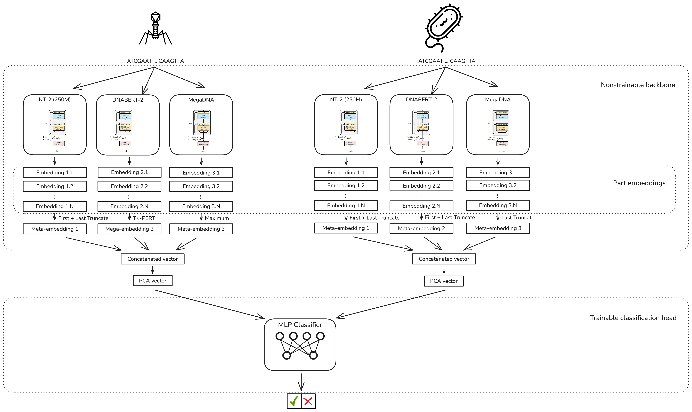

# PBI

This repository contains all the code for the new iteration at solving the PBI problem by the CI4CB laboratory.

It includes a framework to test and verify multiple approaches at solving the problem, with a modular architecture where any part can be tuned.



The framework consists in two branches that embed and compress the DNA sequences of the bacterium and phage, and a classifier that makes the prediction. For each of the branches, first, 3 foundation models are used to compute the embeddings of the sequence, by dividing it into multiple subsequences of maximum size (that the model allows) and embedding all the parts. Then, a strategy is used to transform this set of embeddings to one single meta-embedding, to which PCA is applied to reduce even more the dimensionality. Finally, the meta-embeddings from the two branches are given to the classifier and it predicts wether the two organisms have an interaction or not.

Every part of the architecture is configurable, by passing a YAML configuration to the execution. As an example, [model_configs/example.yaml](model_configs/example.yaml) contains all the parameters that can be used with an explanation.

## Repository structure

```shell
pbi/
├── README.md # This file.
├── analysis/ # Jupyter notebooks to perform different analysis. See the <Utilities> section.
├── data/ # This folder is not included in the repository. You should create it and add all the data inside.
├── doc/ # Extra documentation for developers, showing the specific details for all the code.
├── finetune_nt2.py # Finetuning script for the Nucleotide Transformer v2. See `run_finetune_nt2.sh` file for an example, or run `python finetune_nt2.py --help` to see all the possible parameters.
├── main.py # Main entrypoint for the framework. See the <Execution> section.
├── model_configs/ # YAML configuration files provided as an example. They are used to define all the parameters for each run.
│   ├── example.yaml # Example config with details on all the possible parameters.
│   ├── base.yaml # Basic execution config to use as test.
│   └── best_model.yaml # Best configuration found during the project.
├── pbi_models/ # Implementation of the different classifiers and embedding models.
│   ├── classifiers/ # Classifiers implementation.
│   │   ├── abstract_classifier.py # Abstract classifier class. All the others should inherit from this class, to provide a stable API.
│   │   ├── base.py # Dummy basic classifier, based on an MLP with 1 hidden layer.
│   │   ├── CNN.py # CNN classifiers implementation. Provides BranchCNN and BasicCNN.
│   │   ├── MLP.py # MLP classifiers implementation. Provides BranchMLP and BasicMLP.
│   │   ├── linear.py # Linear classifier. Provides LinearClassifier.
│   │   └── sklearn_classifier. # Sci-kit learn classifiers. Can use any sklearn classifiers with the addition of LightGBM and XGBoost.
│   └── embedders/ # Embedding models implementation.
│       ├── abstract_model.py # Abstract embedder class. All the others should inherit from this class, to provide a stable API.
│       ├── dnabert2.py # DNABERT2 model implementation. Provides the DNABERT2 class.
│       ├── evo.py # EVO1 model implementation. It is not recommended to use, as it can only deal with sequences of up to 512bp. Use at your own risk. Provides the EVO class.
│       ├── megaDNA.py # MegaDNA model implementation. Provides the MegaDNA class.
│       └── nucleotide_transformer_v2.py # Nucleotide Transformer v2 model implementation. Provides the NT2 class.
├── pbi_utils/ # Additional utilities implementation for the project.
│   ├── embeddings_merging_strategies/ # Implementation of the different merging strategies.
│   │   ├── abstract_merger_strategy.py # Abstract merging class. All the others should inherit from this one to provide a stable API.
│   │   ├── average_strategy.py # Provides the AverageStrategy class.
│   │   ├── max_strategy.py # Provides the MaxStrategy class.
│   │   ├── tfidf_strategy.py # Provides the TfidfStrategy and the Tf4idfStrategy classes.
│   │   ├── tkpert_strategy.py # Provides the TKPertStrategy class.
│   │   └── truncate_strategy.py # Provides the TruncateStrategy, BottomTruncateStrategy and TopBottomTruncateStrategy.
│   ├── config_parser.py # Responsible of dealing with the input. Defines all the input parameters and reads them.
│   ├── data_manager.py # Responsible of dealing with reading and storing the DNA data and embeddings.
│   ├── logging.py # Logging system implementation used for the project.
│   ├── types.py # Defines some types that are used in multiple files.
│   └── utils.py # Provides extra utility functions and classes, such a Stats class.
├── requirements.txt # Base requirements file.
├── requirements_nt2_finetuning.txt # Requirements file for finetuning the Nucleotide Transformer v2.
├── run.sh # Basic execution example.
├── run_finetune_nt2.sh # Finetuning example.
└── run_gridsearch.sh # Script to perform gridsearch over some user-defined environment variables.
```

## Environment

Each of the foundation models requires an specific version of libraries, so it is much recommended to set up a Python package manager such as conda or micromamba. In this guide, micromamba with an alias to `mm` is used. If using conda instead, just replace `mm` with `conda`.

### Base Environment
This environment will be used to run everything that does not require a specific environment, for now, everything except the DNABERT2 model and finetuning the Nucleotide Transformer v2.

Start by creating a new environment and activating it.
```bash
mm create -n pbi
mm activate -n pbi
```
> [!IMPORTANT]
> **Make sure that you have activated correctly the environment. If not, the next commands will also work but install everything in your base environment, which might cause problems later on.**

Next, install Python 3.10.18 (higher versions might also work, but this is the one used to develop the project).
```bash
mm install "python==3.10.18"
```

To continue, this project has been developed with CUDA version 12.4. Again, it might work with higher versions, but it has not been tested. To install CUDA 12.4, run:
```bash
mm install cuda-libraries-dev cuda-nvcc cuda-nvtx cuda-cupti nccl -c nvidia/label/cuda-12.4.0
```

Finally, to install all the pip dependencies, run:
```bash
pip install -r requirements.txt
```

If everything worked correctly, congratulations, you can now start executing things.

### DNABERT2 Environment

To use DNABERT2, first, you need to download their repository.
```bash
git clone https://huggingface.co/zhihan1996/DNABERT-2-117M
```

Next, enter their folder, and in the file `flash_attn_triton.py` replace all the occurrences of `tl.dot(q, k, trans_b=True)` (or similar, all the ones that have `trans_a` or `trans_b` as a parameters) with the updated syntax of `tl.dot(q, tl.trans(k))`.
> [!IMPORTANT]
> Take your time replacing them, as in some of them it is the first parameter the one that needs to be transposed. If you make a mistake it might continue to work (or it might not) but obtain bad results.

Finally, starting from the last step in the base environment (create a new one called `pbi-dnabert` and follow the same steps), install now the latest version of triton, with:
```bash
pip install --upgrade triton
```
Pip will complain, as the `torch` version is too old to use the last version of `triton`. Just ignore it and it will work anyways.

### Finetuning Nucleotide Transformer v2

To finetune the Nucleotide Transformer v2 model, create a new environment called `pbi-finetune` and follow the same steps as in the base environment.

Finally, install the extra dependencies for finetuning:
```bash
pip install -r requirements_nt2_finetuning.txt
```

If you want to use then this finetuned model, you will need to run the main framework in this environment. 

## Execution

Once you have your environment correctly set up, the data prepared, and a YAML configuration file created, for example [model_configs/base.yaml](model_configs/base.yaml), to run the framework, execute:
```bash
python main.py -c model_configs/base.yaml
```

This will compute the embeddings for all the sequences (or use the cached ones if you already did it), train the classifier that you specified, and test it on the dataset test split. The train and test results metrics will be shown in the terminal.

> [!NOTE]
> If you are computing the embeddings from scratch with a merging strategy different than [*TruncateStrategy*, *BottomTruncateStrategy* or *TopBottomTruncateStrategy*], it will take multiple hours to finish.

## Utilities

Some bash scripts are also provided to help with specific needs.
- [run.sh](run.sh): Shows an example run test.
- [run_gridsearch.sh](run_gridsearch.sh): Performs a gridsearch over different parameters that can be customized at the start of the file. The intended use is to use environment variables inside the config file (by using `$<env_var>` as a value), and change them inside the script.
- [run_finetune_nt2.sh](run_finetune_nt2.sh): Shows an example of finetuning the Nucleotide Transformer v2.

Additionally, some Jupyter notebooks are also provided, that perform different analysis on the data and models. They are available inside the `analysis/` folder.
- [data_analysis.ipynb](analysis/data_analysis.ipynb): Explores the public and private datasets, and creates one that joins them. It also plots the embeddings from DNABERT2 in a 2D grid to visualize them.
- [embeddings_merging_strategies_analysis.ipynb](analysis/embeddings_merging_strategies_analysis.ipynb): Analyzes the results from the gridsearch over merging strategies, and creates plots to compare them.
- [model_testing.ipynb](analysis/model_testing.ipynb): Explores the results from a trained model, testing it with different datasets and analyzing the predictions.
- [prepare_data_finetuning.ipynb](analysis/prepare_data_finetuning.ipynb): Prepares the data to finetune the Nucleotide Transformer v2 model.